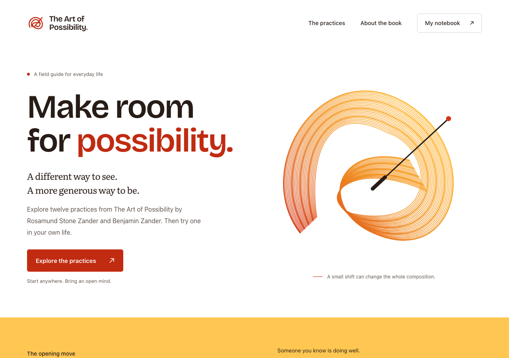
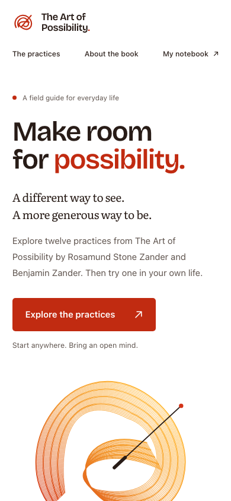

# Craft review — 2026-10-01

## Direction and result

The implemented direction follows the parent’s warm conductor brief: a true
white canvas, amber gesture artwork and teaching surface, vermilion actions,
expressive Bricolage headings, and Literata for sustained reading. The static
build contains 17 pages, including all twelve practices and a real 404 page.

The home page establishes the invitation and one concrete frame-changing
experiment before introducing the practice collection. Lessons give reading,
examples, and exercises distinct treatments. The notebook supports reflection
without scores, streaks, or accounts. No imagery-generation mock was used; the
supplied parent direction was implemented through original HTML/CSS/SVG.

## Visual inspection

Read rendered screenshots of home, collection, lesson, notebook, and About at
desktop, tablet, and mobile sizes. Checked the major home sections and the full
lesson, rather than relying on a hero thumbnail.

Material fixes after inspection:

- Restored spaces at line breaks suppressed on mobile.
- Reduced the rotated book illustration to fit a 320px viewport.
- Kept the book’s spine inside the cover, away from its caption.
- Allowed the decorative cover text to wrap under 200% text enlargement.
- Added a configurable error-page base so recovery links work from missing nested URLs.

The final composition keeps the full amber gesture at desktop and gives it its
own space on mobile. The index is two columns at tablet, one at narrow widths;
the reading pages replace the sticky local navigation with a wrapping link row.

## Validation

- `npm test`: 9 passing tests for content/routes, local links/fragments, HTML
  landmarks, storage validation, preservation, errors, and plain-text export.
- `npm run build`: 17 static HTML documents; no runtime package dependencies.
- `npm run test:browser`: passed in Playwright Chromium.
- Automated axe WCAG A/AA checks: zero violations across all 16 content routes.
- Responsive overflow checks: 320, 390, 768, 1024, and 1440px on five page types.
- Text enlarged to 200%: no horizontal overflow on all five page types.
- Verified keyboard skip link, native details control, and reduced motion.
- Verified the frame selector, combined topic/search filters, empty results,
  filter state after reload, and reset.
- Verified reflection save/reload, HTML-looking input rendered as text, text
  download, deletion cancel/confirm, and storage-unavailable feedback.
- Verified lesson navigation and exercise content with JavaScript disabled.
- Verified `/art-of-possibility/` deployment and nested 404 recovery; invalid
  methods return HTTP 405. No browser exceptions or failed asset requests.
- Impeccable detector: no findings. CSP detector: no policy requiring a patch.
- Fonts are self-hosted; the complete generated site is approximately 404 KiB.

Automated checks do not replace a full assistive-technology audit. Notes remain
specific to the current browser and origin; export is the migration mechanism.

## Selected previews

The complete screenshot set is regenerated under ignored `test-results/` by the
browser suite. Live configuration targets `dist/**/*.html`; rerun injection after
rebuilding and apply accepted design changes to the source files.
